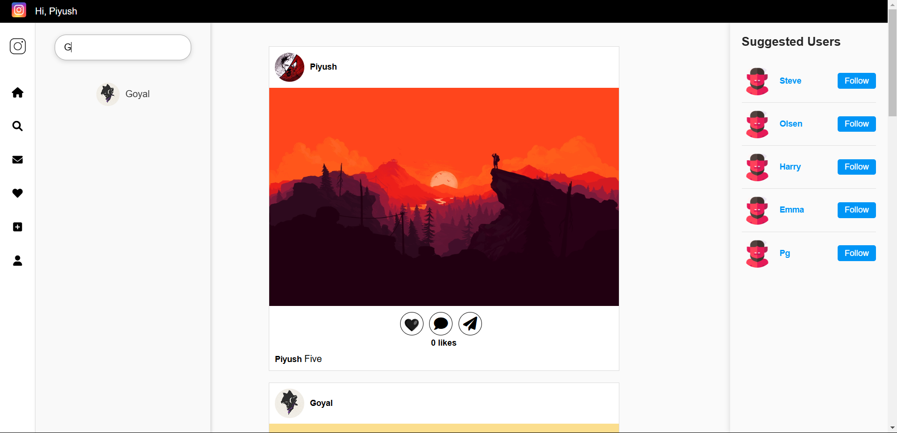
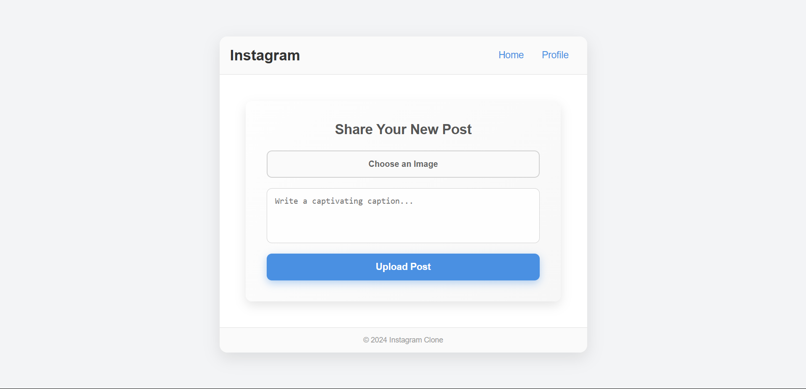
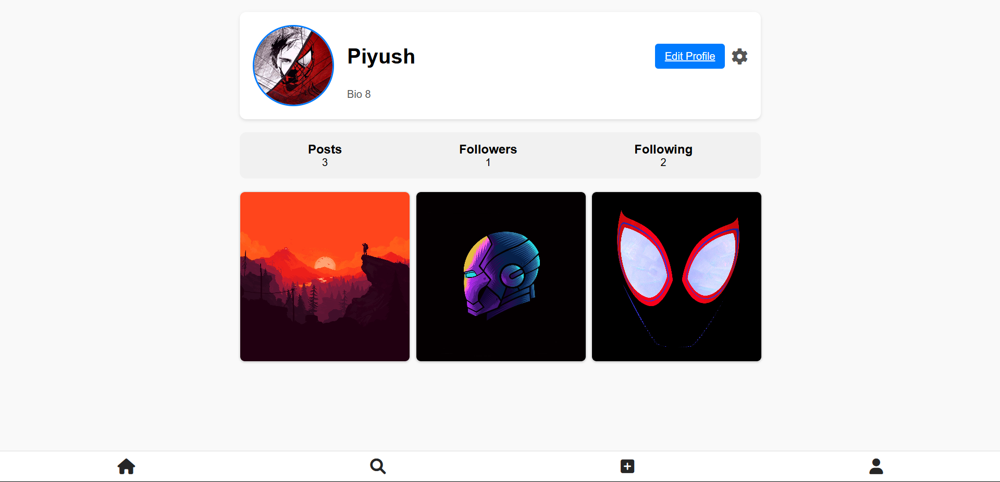
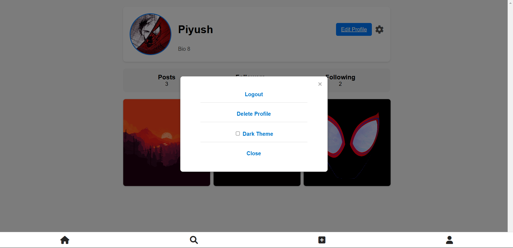
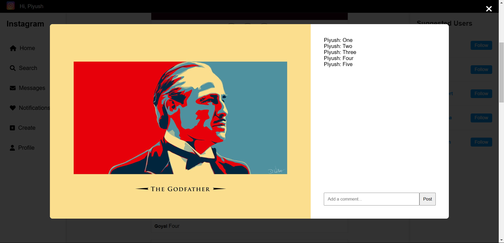

# <u>Instagram Clone Backend</u>
Welcome to the Instagram Clone Backend project! This backend project replicates Instagram’s core features using Node.js, Express.js, MongoDB (hosted on Mongo Atlas), and EJS for dynamic rendering.

# Features:

### **📝 <u>User Authentication</u>**
  - **Signup**: New users can register for the platform. Their passwords are securely encrypted using Passport.js, a middleware that simplifies user authentication. 
  - **Signin**: Users can log in with their credentials. Upon successful authentication, they are redirected to their personalized feed page. 
  - **Forgot Password**: Users can reset their password through a recovery process, which is fully functional. Users receive an email with instructions to reset their password and regain access to their account. 

### **🖼️ <u>Feed Page</u>**
The feed page is the heart of the Instagram clone. Here, users interact with posts and discover new profiles.
 
 

 
### **<u>Center Section</u>**: 
  - Displays posts from people you follow. The posts are dynamically loaded from the database and sorted by the most recent.
    
### **<u>Right Sidebar:</u>**
  - **Suggested Users**: Shows 5 random user recommendations that users can follow. These suggestions change with each page reload.
  - **Follow/Unfollow**: Clicking on a suggested user allows you to follow them, which updates your feed with their posts.

### **<u>Left Sidebar:</u>**
  - **Home**: Clicking on the Home icon redirects you to the feed page.
  - **Search**:
    The search button reveals a smaller sidebar with a search bar that lets you search for users by their usernames.
    If the searched user exists, you can click their profile link to view their posts and follow/unfollow them.

    
  - **Messages**: This button is not yet functional but will soon allow users to send and receive direct messages. 💬
  - **Notifications**:
    Displays any pending friend requests.
    You can accept or reject follow requests, which will update the follower/following lists in real time. ✅❌
  - **Create**: Takes you to the page where you can create a new post to share with your followers. 📸

  

  - **Profile**: Leads to your personal profile page, where you can view and edit your information.

### **👤 <u>Profile Page</u>**
Your profile page displays your personal information and activity.

 

- **Profile Info**: Includes your profile picture (either a default profile picture or one uploaded by the user), username, and bio.
- **Follower/Following Counts**: Displays the number of people following you and the number of people you follow, along with their usernames.
- **User Posts**: Shows all posts you’ve uploaded.
- **Edit Profile**:
  Allows you to update your profile picture, username, and bio. You can also modify the personal details that are displayed to others.
  This is where users can manage their public-facing identity on the platform. 🖼️✏️

### **<u>⚙️ Profile Settings</u>**
 
 
  - **Settings Icon**: Next to the Edit Profile button, there is a settings icon that opens a popup with the following options:
  - **Logout**: Logs the user out and returns them to the signin page.
  - **Delete Profile**: Allows users to permanently delete their account and all associated data.
  - **Dark Theme**: A feature currently being developed that will allow users to switch between light and dark themes. 🌙
  - **Close**: Closes the settings popup.

### **❤️ <u>Like/Comment System</u>**
 

  - **Likes**: Users can like posts they enjoy. This interaction is reflected on the post itself.
  - **Comments**: Users can comment on posts. Comments are visible under each post, allowing users to engage more deeply with the content.
  - **Like/Comment Interaction**: This allows users to interact with posts, making the platform more social and engaging. 💬👍

### **📱 <u>Footer Navigation</u>**
The footer contains quick access buttons for:

  - **Home**: Takes you to the feed page.
  - **Search**: Opens the search sidebar to find new users.
  - **Create**: Takes you to the page for uploading a new post.
  - **Profile**: Takes you to your personal profile page, so you can view and edit your details.

## <u>Future Features to Implement</u> 🌱
  - **Messaging System**: A direct messaging feature for users to communicate with each other.
  - **Story Feature**: Users can post temporary stories that disappear after 24 hours.
  - **Post Editing**: Allow users to edit or delete their posts.

## <u>License</u> 📜
This project is open-source and available under the [MIT LICENSE](LICENSE).
